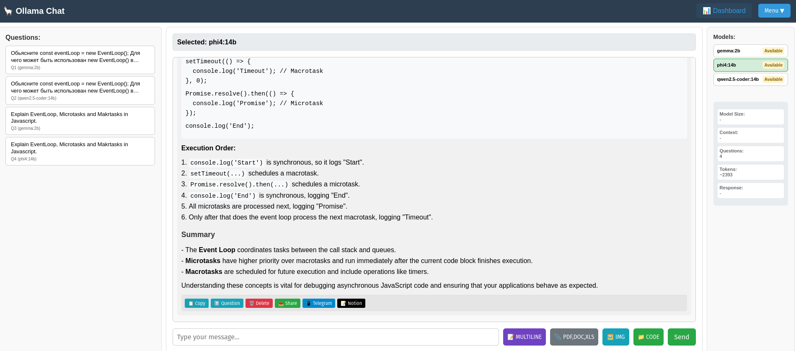

# Ollama Chat App



A modern web chat interface for Ollama models with advanced model management and real-time statistics.

## Features

### Three-Panel Layout
- **Left Panel (20%)**: Available models list with real-time status indicators
- **Middle Panel (70%)**: Chat interface with markdown-formatted responses
- **Right Panel (10%)**: Connection status and live statistics

### Model Management
- Automatic detection of installed Ollama models
- Real-time status monitoring (Running/Available)
- Easy model switching without restart
- Support for any Ollama model

### Enhanced Chat Experience
- Markdown formatting for bot responses (headers, code blocks, tables, etc.)
- Model badges showing which model answered each question
- Real-time response timer with live counter
- Question and token counting
- Responsive full-screen design
- Document and image processing with AI analysis
- Web content extraction from URLs
- Message deletion for conversation curation

### Conversation Persistence
- Auto-save current session (survives page reload)
- Save named conversations with custom titles
- Load and manage multiple saved conversations
- Export conversations to JSON files
- Clear current chat functionality

### Document Processing
- PDF file upload and text extraction
- Word document processing (DOC/DOCX)
- Excel spreadsheet analysis (XLS/XLSX/CSV)
- Automatic document analysis with any text model
- File preview with name and size display
- Support for document-based conversations

### Image Processing
- Image upload and analysis with vision models
- Support for JPG, PNG, GIF, BMP, WEBP formats
- Visual recognition and image reasoning
- Image captioning and question answering
- Compatible with llama3.2-vision, llava, and other vision models

### Web Content Processing
- Automatic URL detection in messages
- Web page content extraction and analysis
- Clean article text extraction using Mozilla Readability
- Support for news articles, blogs, and documentation
- Rate limiting (max 3 URLs per message) with timeout protection

### Statistics Dashboard
- Model size display
- Context window size
- Live question count (user questions only)
- Estimated token usage
- Real-time response time tracking

## Setup

1. **Install Ollama:**
   - Go to [ollama.com](https://ollama.com)
   - Download and install for your operating system
   - Follow the installation prompts

2. **Download models:**
   ```bash
   # Download models (choose any you prefer)
   ollama pull phi4:latest
   ollama pull llama3.2
   ollama pull qwen2.5-coder
   ```

3. **Install app dependencies:**
   ```bash
   npm install
   ```

4. **Start the server:**
   ```bash
   node server.js
   ```

5. **Open in browser:**
   ```
   http://localhost:3000
   ```

## Usage

1. The app will automatically detect all your installed Ollama models
2. Models currently loaded in memory will show as "Running"
3. Click on any model to select it for chat
4. Start chatting! Responses are formatted with markdown for better readability
5. Upload documents using the 📎 PDF,DOC,XLS button or images using the 🖼️ IMG button
6. Include URLs in messages for automatic web content analysis
7. Delete unwanted question-answer pairs by hovering over user messages and clicking ✕
8. Monitor your usage with real-time statistics in the right panel
9. Use the menu to save, load, or export conversations
10. Your current conversation auto-saves and restores on page reload

## Features in Detail

### Conversation Management
- **Auto-save**: Current conversation automatically saved to localStorage
- **Named saves**: Save important conversations with custom names
- **Load conversations**: Browse and load any saved conversation
- **Export**: Download conversations as JSON files for backup
- **Clear chat**: Reset current conversation when needed

### Smart Statistics
- **Questions**: Counts only user questions (not total messages)
- **Response time**: Live timer showing model response speed
- **Tokens**: Estimated token usage for cost tracking
- **Model info**: Size and context window for each model

### Conversation Management
- **Message deletion**: Remove unwanted question-answer pairs
- **Auto-save**: Current conversation automatically saved to localStorage
- **Named saves**: Save important conversations with custom names
- **Load conversations**: Browse and load any saved conversation
- **Export**: Download conversations as JSON files for backup

### Model Support
- **Text models**: Full chat support with document processing (phi4, llama, qwen, etc.)
- **Vision models**: Image analysis and visual reasoning (llama3.2-vision, llava, etc.)
- **Embedding models**: Detected and marked as unavailable for chat
- **Document analysis**: All text models can process PDF, DOC, DOCX, XLS, XLSX, CSV files
- **Image analysis**: Vision models can analyze JPG, PNG, GIF, BMP, WEBP images
- **Web content**: All text models can analyze content from URLs automatically

## API Endpoints

- `GET /api/models` - List all available models with status
- `GET /api/status` - Check Ollama connection status
- `POST /api/chat` - Send message to selected model

## Requirements

- Node.js
- Ollama installed and running
- At least one Ollama model downloaded

## Dependencies

- `express` - Web server framework
- `node-fetch` - HTTP client for Ollama API
- `multer` - File upload handling
- `pdfjs-dist` - PDF text extraction
- `word-extractor` - DOC/DOCX text extraction
- `xlsx` - Excel spreadsheet processing
- `@mozilla/readability` - Web content extraction
- `jsdom` - Server-side DOM parsing
- `cheerio` - HTML parsing utilities