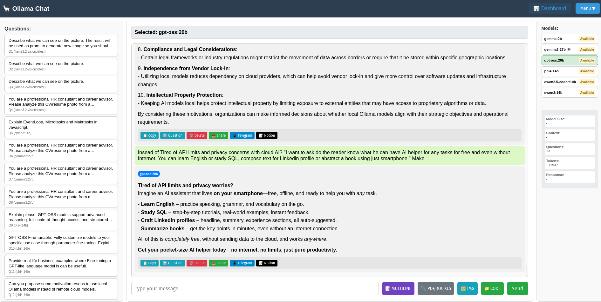
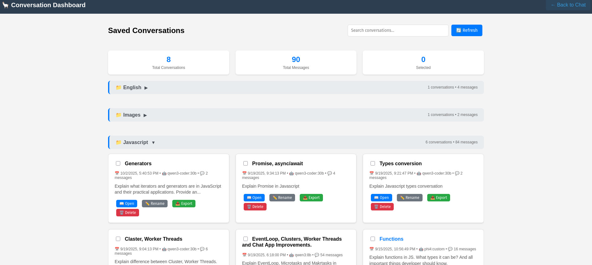

# Ollama Chat App




A modern web chat interface for Ollama models with advanced model management and real-time statistics.

## Features

### Three-Panel Layout
- **Left Panel (20%)**: Questions navigation panel with model indicators
- **Middle Panel (70%)**: Chat interface with markdown-formatted responses
- **Right Panel (10%)**: Available models list and live statistics

### Model Management
- Automatic detection of installed Ollama models
- Real-time status monitoring (Running/Available)
- Visual indicators for model types (vision models marked with 👁️)
- Easy model switching without restart
- Support for any Ollama model

### Enhanced Chat Experience
- Markdown formatting for both user questions and bot responses (headers, code blocks, tables, etc.)
- Model badges showing which model answered each question
- Real-time response timer with live counter
- Question and token counting
- Responsive full-screen design
- Document and image processing with AI analysis
- Web content extraction from URLs
- Message deletion for conversation curation
- Professional image message layout with thumbnails
- Multiline input modal for complex messages with code
- Message actions: copy, jump to question, delete Q&A pairs
- Questions navigation panel with model names for easy conversation browsing

### Conversation Persistence
- Auto-save current session (survives page reload)
- Save named conversations with custom titles and categories
- Category autocomplete with Tab/Arrow key navigation
- Load and manage multiple saved conversations
- Return to current conversation after browsing saved ones
- Export conversations to JSON files
- Clear current chat functionality
- Dedicated dashboard for conversation management

### Document Processing
- PDF file upload and text extraction
- Word document processing (DOC/DOCX)
- Excel spreadsheet analysis (XLS/XLSX/CSV)
- Automatic document analysis with any text model
- File preview with name and size display
- Support for document-based conversations

### Code File Processing
- Multiple code file upload (up to 50 files)
- Support for all major programming languages (.js, .py, .java, .html, .css, etc.)
- Cumulative file selection across different folders
- Structured code analysis and recommendations
- Project-wide code review capabilities

### Image Processing
- Image upload and analysis with vision models
- Support for JPG, PNG, GIF, BMP, WEBP formats
- Visual recognition and image reasoning
- Image captioning and question answering
- Compatible with llama3.2-vision, llava, gemma3, and other vision models
- Professional message layout with image thumbnails and filename display
- Click thumbnails to view full-size images in modal

### Web Content Processing
- Automatic URL detection in messages
- Web page content extraction and analysis
- Clean article text extraction using Mozilla Readability
- Support for news articles, blogs, and documentation
- Rate limiting (max 3 URLs per message) with timeout protection

### Statistics Dashboard
- Model size display
- Context window size
- Live question count (user questions only)
- Estimated token usage
- Real-time response time tracking

## Setup

### Option 1: Docker Setup (Recommended)

1. **Run Ollama in Docker:**
   ```bash
   # Make script executable and run
   chmod +x run-ollama-docker.sh
   ./run-ollama-docker.sh
   ```
   This script will:
   - Install Docker if not present
   - Install NVIDIA Container Toolkit for GPU support
   - Stop local Ollama service
   - Start Ollama in Docker container with GPU access

2. **Download models:**
   ```bash
   # Download models inside Docker container
   docker exec -it ollama ollama pull phi4:latest
   docker exec -it ollama ollama pull llama3.2
   docker exec -it ollama ollama pull qwen2.5-coder
   ```

3. **Install app dependencies:**
   ```bash
   npm install
   ```

4. **Start the server:**
   ```bash
   node server.js
   ```

5. **Open in browser:**
   ```
   http://localhost:3000
   ```

### Option 2: Local Installation

1. **Install Ollama:**
   - Go to [ollama.com](https://ollama.com)
   - Download and install for your operating system
   - Follow the installation prompts

2. **Download models:**
   ```bash
   # Download models (choose any you prefer)
   ollama pull phi4:latest
   ollama pull llama3.2
   ollama pull qwen2.5-coder
   ```

3. **Install app dependencies:**
   ```bash
   npm install
   ```

4. **Start the server:**
   ```bash
   node server.js
   ```

5. **Open in browser:**
   ```
   http://localhost:3000
   ```

## Usage

1. The app will automatically detect all your installed Ollama models
2. Models currently loaded in memory will show as "Running"
3. Click on any model to select it for chat
4. Start chatting! Responses are formatted with markdown for better readability
5. Use 📝 MULTILINE button for complex messages with code blocks and formatting
6. Upload documents using the 📎 PDF,DOC,XLS button or images using the 🖼️ IMG button
7. Upload code files using the 📁 CODE button (supports multiple files and cumulative selection)
8. Include URLs in messages for automatic web content analysis
9. Use message actions: copy questions/answers, jump between Q&A pairs, delete unwanted pairs
10. View uploaded images as clean thumbnails with filenames displayed below
11. Monitor your usage with real-time statistics in the right panel
12. Use the menu to save, load, or export conversations
13. Return to your working conversation after loading saved ones (preserves your progress)
14. Navigate through your conversation using the Questions panel (shows Q1, Q2, etc. with model names)
15. Access the Dashboard to manage all saved conversations with search, bulk operations, and statistics
16. Your current conversation auto-saves and restores on page reload

## Features in Detail

### Conversation Management
- **Auto-save**: Current conversation automatically saved to localStorage
- **Named saves**: Save important conversations with custom names and categories
- **Category system**: Organize conversations by topics (Javascript, English, Python, etc.)
- **Smart autocomplete**: Existing categories suggested with Tab/Arrow navigation
- **Update conversations**: Modify loaded conversations and update original or save as new
- **Current conversation backup**: Preserves working conversation when browsing saved ones
- **Return to current**: Easy way to get back to your working conversation
- **Dashboard**: Dedicated page for managing all conversations with category organization
- **Accordion interface**: Collapsible category sections for better organization
- **Search & Filter**: Find conversations by name or content across all categories
- **Bulk Operations**: Select and manage multiple conversations at once
- **Export**: Download individual or multiple conversations as JSON files
- **Rename**: Edit conversation names inline
- **Statistics**: View total conversations and message counts per category

### Smart Statistics
- **Questions**: Counts only user questions (not total messages)
- **Response time**: Live timer showing model response speed
- **Tokens**: Estimated token usage for cost tracking
- **Model info**: Size and dynamic context window detection for each model
- **Context detection**: Automatically detects custom context window sizes (e.g., 64K, 128K)

### Dashboard Features
- **Category Organization**: Conversations grouped by learning topics (Javascript, English, etc.)
- **Accordion Categories**: Click category headers to collapse/expand sections
- **Conversation Grid**: Visual cards showing all saved conversations
- **Search Functionality**: Real-time search through conversation names and content
- **Bulk Operations**: Select multiple conversations for batch export or deletion
- **Statistics Overview**: Total conversations, messages, and selection counts per category
- **Individual Management**: Rename, export, delete, or open any conversation
- **Direct Loading**: Open conversations directly from dashboard to main chat

### Model Support
- **Text models**: Full chat support with document and code processing (phi4, llama, qwen, etc.)
- **Vision models**: Image analysis and visual reasoning (llama3.2-vision, llava, gemma3, etc.) - marked with 👁️ eye icon
- **Embedding models**: Detected and marked as unavailable for chat
- **Document analysis**: All text models can process PDF, DOC, DOCX, XLS, XLSX, CSV files
- **Code analysis**: All text models can analyze multiple code files for reviews and recommendations
- **Image analysis**: Vision models (llama3.2-vision, llava, gemma3) can analyze JPG, PNG, GIF, BMP, WEBP images
- **Web content**: All text models can analyze content from URLs automatically
- **Alphabetical sorting**: Models displayed in alphabetical order for easy navigation

## API Endpoints

- `GET /api/models` - List all available models with status
- `GET /api/status` - Check Ollama connection status
- `POST /api/chat` - Send message to selected model
- `POST /api/show` - Get detailed model information including context window size

## Requirements

### For Docker Setup:
- Node.js
- Docker and Docker Compose
- NVIDIA GPU (optional, for GPU acceleration)
- NVIDIA Container Toolkit (for GPU support)

### For Local Setup:
- Node.js
- Ollama installed and running
- At least one Ollama model downloaded

## Docker Configuration

The `docker-compose.yml` includes:
- GPU support with NVIDIA runtime
- Persistent model storage
- Optimized memory and context settings
- Port mapping to localhost:11434

## Dependencies

- `express` - Web server framework
- `node-fetch` - HTTP client for Ollama API
- `multer` - File upload handling
- `pdfjs-dist` - PDF text extraction
- `word-extractor` - DOC/DOCX text extraction
- `xlsx` - Excel spreadsheet processing
- `@mozilla/readability` - Web content extraction
- `jsdom` - Server-side DOM parsing
- `cheerio` - HTML parsing utilities
