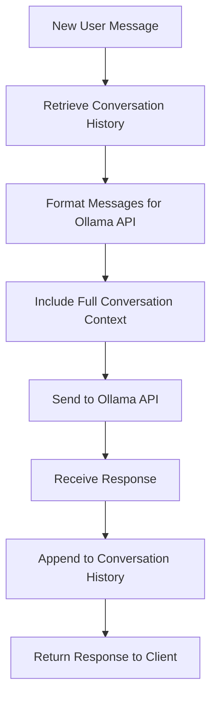
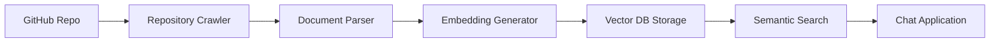
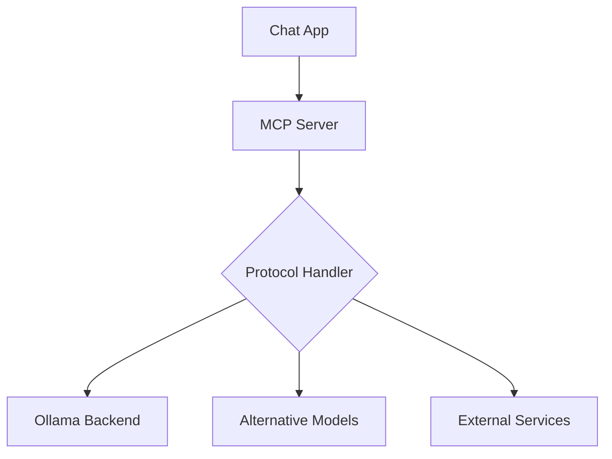

# Revised Comprehensive Solution Proposal for Chat App Enhancement

## Overview
This document outlines solutions for three critical enhancements to the existing chat application:
1. Saving context between requests (including model-level conversation history)
2. Adding vector database for document indexing of GitHub repositories
3. Adding MCP (Model Context Protocol) support

## Current Architecture Analysis

### Key Components
- **Frontend**: HTML/CSS/JavaScript client in `public/` directory
- **Backend**: Express.js server in `server.js` 
- **AI Integration**: Communicates with Ollama API at `http://localhost:11434`
- **File Handling**: PDF, DOC, XLS, image processing with multer
- **Deployment**: Docker container with GPU support

### Current Limitations
- No persistent conversation context between sessions (browser memory only)
- **Critical Issue**: Model loses context between individual messages within a session
- No external document indexing capability
- No standardized protocol for model communication

## Problem Clarification: Model-Level Context Loss

The primary issue is more significant than just browser session persistence. The model loses context between individual messages because each request to the Ollama API is stateless and only includes the current message, not the entire conversation history.

**Example of the problem:**
- Response 1 after Question 1 includes: "Если хочешь, могу показать ещё один пример с useEffect и useDeferredValue, чтобы показать, как это работает на практике."
- Question 2: "Покажи"
- Expected: Model should remember previous context and show the example
- Actual: Model responds with "Привет! Похоже, вы хотите, чтобы я что-то показал, но не совсем понятно, что именно..."

## Solution 1: Context Persistence Between Messages

### Problem Statement
The model loses conversation context between individual messages, treating each query as independent.

### Proposed Solution
Implement a conversation history management system that maintains the complete conversation thread and sends it with each request to the Ollama API.

### Architecture


### Implementation Steps
1. **Modify Chat Endpoint Logic**
   - Track conversation history per session
   - Format messages as a complete conversation thread
   - Send full context to Ollama API with each request

2. **Conversation History Structure**
   - Store messages as role/content pairs (user/assistant)
   - Implement conversation history truncation for context limits
   - Add metadata for conversation management

3. **Ollama API Integration**
   - Switch from `/api/generate` to `/api/chat` endpoint
   - Format messages as a conversation array
   - Handle context window limits appropriately

4. **Context Window Management**
   - Implement sliding window for long conversations
   - Preserve important context while staying within limits
   - Add warnings when approaching context boundaries

### Technical Implementation
- **Data Structure**: Array of message objects with role and content
- **API Change**: Use Ollama's chat endpoint which supports conversation history
- **Context Limits**: Implement intelligent truncation to stay within model limits

## Solution 2: Vector Database for GitHub Repository Indexing

### Problem Statement
The application currently lacks the ability to index and search external document repositories like GitHub repositories.

### Proposed Solution
Integrate a vector database (ChromaDB or Pinecone) with GitHub repository indexing capabilities.

### Architecture


### Implementation Steps
1. **Select Vector Database**
   - **Recommendation**: ChromaDB (open-source, lightweight)
   - Alternative: Pinecone (managed, scalable)
   - Justification: ChromaDB integrates well with JavaScript ecosystem

2. **GitHub Repository Integration**
   - Add GitHub OAuth for repository access
   - Implement repository crawler for common code files
   - Parse .js, .ts, .py, .java, .html, .css, .md, etc.

3. **Document Processing Pipeline**
   - File extraction and preprocessing
   - Text chunking for optimal embedding
   - Embedding generation using Ollama models

4. **Search Integration**
   - Semantic search endpoint
   - Hybrid search combining keyword and semantic matching
   - Context injection into chat responses

### Technical Implementation
- **Dependencies**: `chromadb`, `@octokit/rest`, `langchain`
- **Data Pipeline**: GitHub API → File extraction → Embedding → Vector storage
- **Search Strategy**: Cosine similarity with relevance scoring

## Solution 3: MCP (Model Context Protocol) Support

### Problem Statement
The application currently communicates directly with Ollama API without standardized protocols for model interaction.

### Proposed Solution
Implement MCP (Model Context Protocol) to enable standardized communication between the application and AI models.

### Architecture


### Implementation Steps
1. **MCP Server Setup**
   - Implement MCP-compliant server
   - Define standard endpoints and message formats
   - Add connection pooling for model backends

2. **Protocol Adapters**
   - Ollama adapter for existing functionality
   - Standardized request/response formats
   - Error handling and fallback mechanisms

3. **Model Abstraction Layer**
   - Abstract model-specific implementations
   - Enable easy addition of new model providers
   - Maintain backward compatibility

4. **Configuration Management**
   - MCP endpoint discovery
   - Model capability negotiation
   - Dynamic model registration

### Technical Implementation
- **Dependencies**: `@model-context-protocol/server`, `zod` for validation
- **Architecture**: Adapter pattern for different model backends
- **Standards**: Follow MCP specification for interoperability

## Implementation Roadmap

### Phase 1: Context Persistence (Weeks 1-2)
1. Modify server.js to use Ollama's /api/chat endpoint
2. Implement conversation history tracking
3. Format messages as complete conversation threads
4. Add context window management
5. Test conversation continuity between messages

### Phase 2: Vector Database Integration (Weeks 3-5)
1. Set up ChromaDB infrastructure
2. Implement GitHub repository indexing
3. Develop document processing pipeline
4. Integrate semantic search with chat flow

### Phase 3: MCP Support (Weeks 6-7)
1. Implement MCP server
2. Create Ollama adapter
3. Test with existing models
4. Add configuration management

### Phase 4: Integration and Testing (Week 8)
1. End-to-end testing
2. Performance optimization
3. Security audit
4. Documentation and deployment

## Infrastructure Changes

### Updated docker-compose.yml
```yaml
services:
  chromadb:
    image: chromadb/chroma:latest
    ports:
      - "8000:8000"
    volumes:
      - chroma_data:/chroma/chroma

  ollama:
    # existing configuration

  mcp-server:
    build: ./mcp-server
    ports:
      - "8080:8080"
    depends_on:
      - chromadb

volumes:
  chroma_data:
  ollama_data:
```

## Risk Assessment

### Technical Risks
- **Context Length**: Long conversations may exceed model context windows
- **Performance**: Larger payloads may slow response times
- **Compatibility**: MCP adoption may face resistance

### Mitigation Strategies
- **Context Management**: Implement smart truncation algorithms
- **Optimization**: Cache frequently accessed context when possible
- **Fallback**: Maintain direct Ollama integration as backup

## Success Metrics

### Quantitative
- Conversation continuity success rate > 95%
- Context window utilization < 80% of maximum
- Response time degradation < 10%

### Qualitative
- Improved user experience with persistent context
- Better document search capabilities
- Standardized model communication

## Conclusion

These three enhancements will significantly improve the application's functionality:

1. **Context Persistence** will maintain conversation continuity between all messages, solving the core issue where the model loses context between individual queries
2. **Vector Database Integration** will enable sophisticated document search capabilities
3. **MCP Support** will provide standardized model communication and future extensibility

The revised approach focuses on the critical issue of model-level context loss, which is the most impactful improvement for user experience.