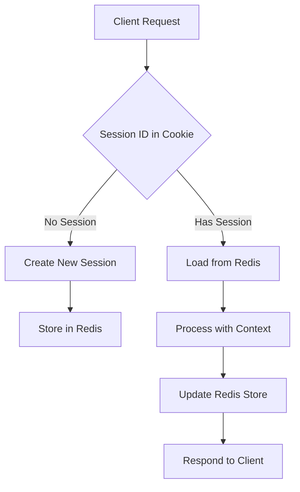
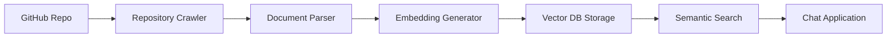
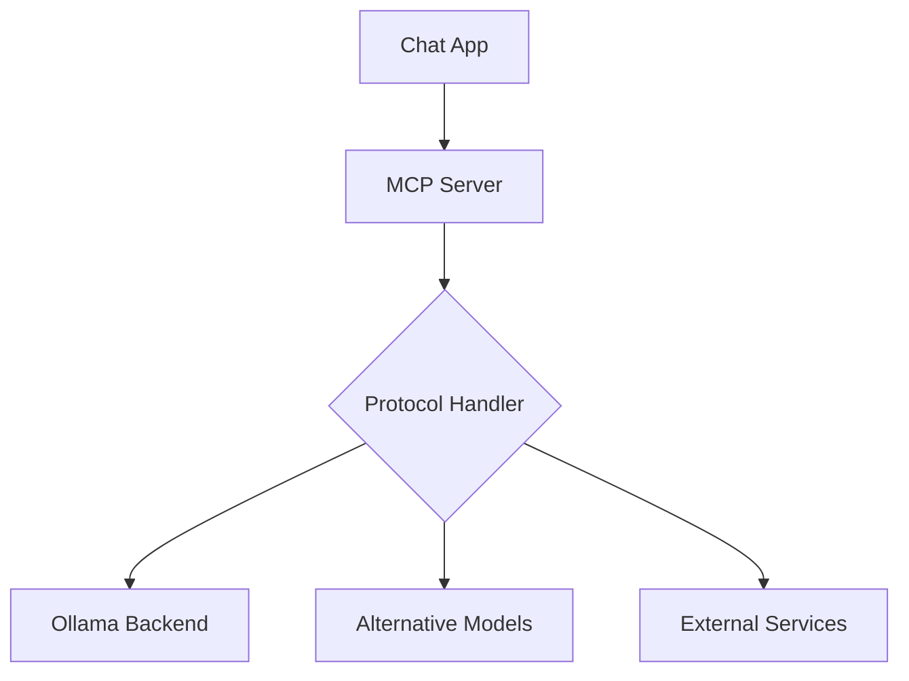

# Comprehensive Solution Proposal for Chat App Enhancement

## Overview
This document outlines solutions for three critical enhancements to the existing chat application:
1. Saving context between requests
2. Adding vector database for document indexing of GitHub repositories
3. Adding MCP (Model Context Protocol) support

## Current Architecture Analysis

### Key Components
- **Frontend**: HTML/CSS/JavaScript client in `public/` directory
- **Backend**: Express.js server in `server.js` 
- **AI Integration**: Communicates with Ollama API at `http://localhost:11434`
- **File Handling**: PDF, DOC, XLS, image processing with multer
- **Deployment**: Docker container with GPU support

### Current Limitations
- No persistent conversation context between sessions
- No external document indexing capability
- No standardized protocol for model communication

## Solution 1: Context Persistence Between Requests

### Problem Statement
The current application maintains conversation history only in browser memory and loses context on page refresh or between user sessions.

### Proposed Solution
Implement a comprehensive session management system using Redis for storing conversation contexts.

### Architecture


### Implementation Steps
1. **Add Session Middleware**
   - Integrate express-session with Redis store
   - Generate unique session IDs for users
   - Configure session expiration policies

2. **Modify Chat Endpoint**
   - Associate conversations with session IDs
   - Retrieve previous conversation context
   - Maintain message history in Redis

3. **Redis Schema Design**
   ```
   session:{sessionId}:conversations
   session:{sessionId}:context
   session:{sessionId}:metadata
   ```

4. **Security Considerations**
   - Encrypt sensitive conversation data
   - Implement proper session cleanup
   - Add rate limiting per session

### Technical Implementation
- **Dependencies**: `express-session`, `connect-redis`, `redis`
- **Configuration**: Add Redis container to docker-compose.yml
- **Data Structure**: Hash maps to store conversation history per session

## Solution 2: Vector Database for GitHub Repository Indexing

### Problem Statement
The application currently lacks the ability to index and search external document repositories like GitHub repositories.

### Proposed Solution
Integrate a vector database (ChromaDB or Pinecone) with GitHub repository indexing capabilities.

### Architecture


### Implementation Steps
1. **Select Vector Database**
   - **Recommendation**: ChromaDB (open-source, lightweight)
   - Alternative: Pinecone (managed, scalable)
   - Justification: ChromaDB integrates well with JavaScript ecosystem

2. **GitHub Repository Integration**
   - Add GitHub OAuth for repository access
   - Implement repository crawler for common code files
   - Parse .js, .ts, .py, .java, .html, .css, .md, etc.

3. **Document Processing Pipeline**
   - File extraction and preprocessing
   - Text chunking for optimal embedding
   - Embedding generation using Ollama models

4. **Search Integration**
   - Semantic search endpoint
   - Hybrid search combining keyword and semantic matching
   - Context injection into chat responses

### Technical Implementation
- **Dependencies**: `chromadb`, `@octokit/rest`, `langchain`
- **Data Pipeline**: GitHub API → File extraction → Embedding → Vector storage
- **Search Strategy**: Cosine similarity with relevance scoring

## Solution 3: MCP (Model Context Protocol) Support

### Problem Statement
The application currently communicates directly with Ollama API without standardized protocols for model interaction.

### Proposed Solution
Implement MCP (Model Context Protocol) to enable standardized communication between the application and AI models.

### Architecture


### Implementation Steps
1. **MCP Server Setup**
   - Implement MCP-compliant server
   - Define standard endpoints and message formats
   - Add connection pooling for model backends

2. **Protocol Adapters**
   - Ollama adapter for existing functionality
   - Standardized request/response formats
   - Error handling and fallback mechanisms

3. **Model Abstraction Layer**
   - Abstract model-specific implementations
   - Enable easy addition of new model providers
   - Maintain backward compatibility

4. **Configuration Management**
   - MCP endpoint discovery
   - Model capability negotiation
   - Dynamic model registration

### Technical Implementation
- **Dependencies**: `@model-context-protocol/server`, `zod` for validation
- **Architecture**: Adapter pattern for different model backends
- **Standards**: Follow MCP specification for interoperability

## Implementation Roadmap

### Phase 1: Context Persistence (Weeks 1-2)
1. Set up Redis infrastructure
2. Implement session management
3. Test context persistence across sessions
4. Add security measures

### Phase 2: Vector Database Integration (Weeks 3-5)
1. Set up ChromaDB infrastructure
2. Implement GitHub repository indexing
3. Develop document processing pipeline
4. Integrate semantic search with chat flow

### Phase 3: MCP Support (Weeks 6-7)
1. Implement MCP server
2. Create Ollama adapter
3. Test with existing models
4. Add configuration management

### Phase 4: Integration and Testing (Week 8)
1. End-to-end testing
2. Performance optimization
3. Security audit
4. Documentation and deployment

## Infrastructure Changes

### Updated docker-compose.yml
```yaml
services:
  redis:
    image: redis:alpine
    ports:
      - "6379:6379"
    volumes:
      - redis_data:/data

  chromadb:
    image: chromadb/chroma:latest
    ports:
      - "8000:8000"
    volumes:
      - chroma_data:/chroma/chroma

  ollama:
    # existing configuration
    depends_on:
      - redis

  mcp-server:
    build: ./mcp-server
    ports:
      - "8080:8080"
    depends_on:
      - redis
      - chromadb

volumes:
  redis_data:
  chroma_data:
  ollama_data:
```

## Risk Assessment

### Technical Risks
- **Performance**: Additional layers may slow response times
- **Complexity**: More components increase maintenance overhead
- **Compatibility**: MCP adoption may face resistance

### Mitigation Strategies
- **Performance**: Implement caching and optimize queries
- **Monitoring**: Add comprehensive logging and metrics
- **Rollback Plan**: Maintain backward compatibility

## Success Metrics

### Quantitative
- Response time degradation < 20%
- Context persistence success rate > 99%
- Vector search accuracy > 90%

### Qualitative
- Improved user experience with persistent context
- Better document search capabilities
- Standardized model communication

## Conclusion

These three enhancements will significantly improve the application's functionality:

1. **Context Persistence** will maintain conversation continuity across sessions
2. **Vector Database Integration** will enable sophisticated document search capabilities
3. **MCP Support** will provide standardized model communication and future extensibility

The proposed architecture balances functionality, maintainability, and performance while preserving the existing application's strengths.